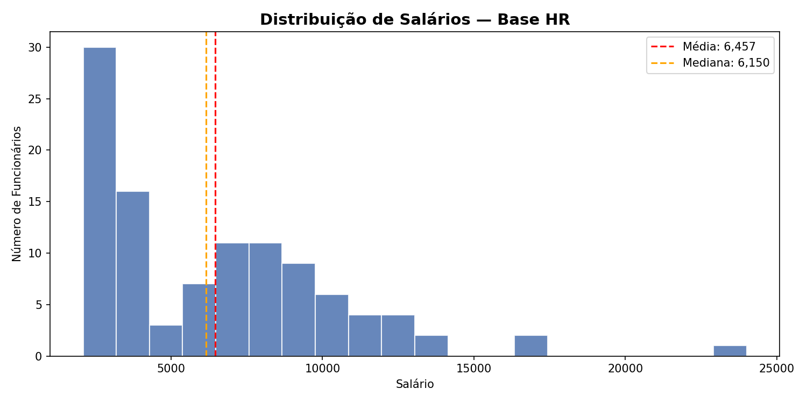
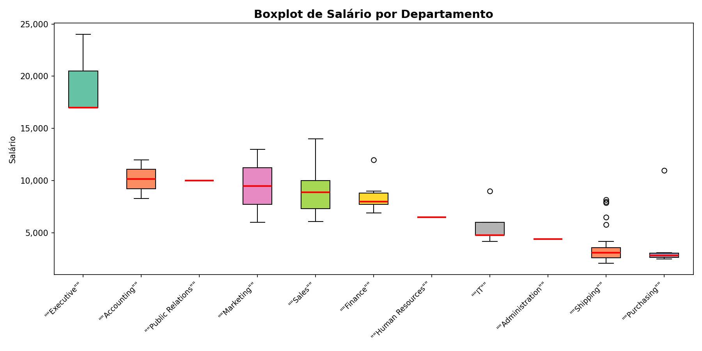
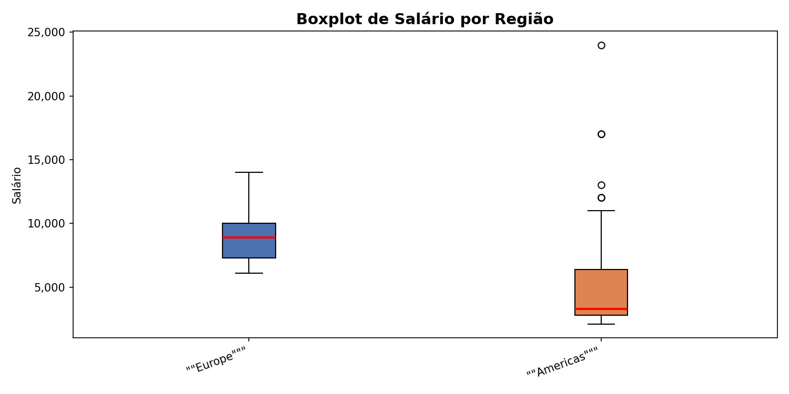

# Projeto Módulo 1 — Visualização de Dados e Business Intelligence

**Aluno:** André Abranjo Ramos
**Turma:** Visualização de Dados e Business Intelligence [T2]
**Data de entrega:** 16/07/2026

---

## Objetivo do Trabalho

Atuar como analista de dados analisando informações de Recursos Humanos
extraídas do banco **FreeSQL** (esquema HR). O objetivo é praticar SQL,
Python e análise exploratória de dados de forma integrada, simulando
uma rotina básica de trabalho analítico.

O foco da análise é entender:

- A distribuição de salários por departamento e cargo
- A distribuição geográfica de funcionários por região e país
- Padrões de remuneração e identificação de outliers salariais

---

## Tabelas Utilizadas

| Tabela | Descrição |
|--------|-----------|
| `HR.EMPLOYEES` | Dados dos funcionários: nome, salário, cargo, departamento e data de contratação |
| `HR.DEPARTMENTS` | Nome e localização dos departamentos |
| `HR.JOBS` | Cargos e faixas salariais mínima e máxima |
| `HR.LOCATIONS` | Cidade, estado e código do país de cada departamento |
| `HR.COUNTRIES` | Nome e código dos países onde a empresa opera |
| `HR.REGIONS` | Regiões geográficas: Americas, Europe, Asia, Middle East and Africa |

---

## Consultas SQL

Arquivos: [`query 1.sql`](query 1.sql) e [`query 2.sql`](query 2.sql)

---

### Query 1 — Salário por Departamento e Cargo

**Objetivo:** analisar a distribuição de salários por departamento e cargo,
incluindo as faixas salariais mínima e máxima definidas para cada função.

**Tabelas relacionadas:** `EMPLOYEES` + `DEPARTMENTS` + `JOBS`

**Relacionamentos:** 2 LEFT JOIN

**Filtro aplicado:** `WHERE DEPARTMENT_ID IS NOT NULL`
— garante que apenas funcionários alocados em um departamento sejam incluídos.

```sql
SELECT
    E.EMPLOYEE_ID,
    E.FIRST_NAME,
    E.LAST_NAME,
    E.SALARY,
    E.HIRE_DATE,
    D.DEPARTMENT_NAME,
    J.JOB_TITLE,
    J.MIN_SALARY AS SALARIO_MINIMO_CARGO,
    J.MAX_SALARY AS SALARIO_MAXIMO_CARGO
FROM HR.EMPLOYEES E
LEFT JOIN HR.DEPARTMENTS D ON E.DEPARTMENT_ID = D.DEPARTMENT_ID
LEFT JOIN HR.JOBS J ON E.JOB_ID = J.JOB_ID
WHERE E.DEPARTMENT_ID IS NOT NULL
ORDER BY D.DEPARTMENT_NAME, E.SALARY DESC;
```

**Resultado exportado:** `export_queri1.csv`

---

### Query 2 — Funcionários por Região

**Objetivo:** analisar salários e distribuição geográfica dos funcionários
por cidade, país e região.

**Tabelas relacionadas:** `EMPLOYEES` + `DEPARTMENTS` + `LOCATIONS` + `COUNTRIES` + `REGIONS`

**Relacionamentos:** 4 LEFT JOIN

**Filtro aplicado:** `WHERE REGION_NAME IS NOT NULL`
— garante que apenas funcionários com localização geográfica completa sejam incluídos.

```sql
SELECT
    E.EMPLOYEE_ID,
    E.FIRST_NAME,
    E.LAST_NAME,
    E.SALARY,
    D.DEPARTMENT_NAME,
    L.CITY,
    L.STATE_PROVINCE,
    C.COUNTRY_NAME,
    R.REGION_NAME
FROM HR.EMPLOYEES E
LEFT JOIN HR.DEPARTMENTS D ON E.DEPARTMENT_ID = D.DEPARTMENT_ID
LEFT JOIN HR.LOCATIONS L ON D.LOCATION_ID = L.LOCATION_ID
LEFT JOIN HR.COUNTRIES C ON L.COUNTRY_ID = C.COUNTRY_ID
LEFT JOIN HR.REGIONS R ON C.REGION_ID = R.REGION_ID
WHERE R.REGION_NAME IS NOT NULL
ORDER BY R.REGION_NAME, C.COUNTRY_NAME, E.SALARY DESC;
```

**Resultado exportado:** `export_queri2.csv`

---

## Análise exploratória em Python

Arquivo: [`analise.py`](analise.py)

### Como os dados foram buscados

Os dados foram extraídos diretamente do banco FreeSQL usando as duas
consultas SQL descritas acima. Os resultados foram exportados em formato
CSV e importados no Python com a biblioteca `pandas`.

### Como a base foi tratada

- Nomes das colunas padronizados: aspas e espaços removidos, tudo em maiúsculo
- Leitura com `quoting=3` para evitar problemas com aspas nos cabeçalhos dos CSVs exportados pelo FreeSQL
- Nenhuma linha foi removida — a base foi usada como extraída

### Etapas da Análise Exploratória de Dados (EDA)

| Etapa | Descrição |
|-------|-----------|
| 1. Carregamento | Leitura dos dois CSVs com pandas |
| 2. Visão inicial | Colunas, tipos e primeiras linhas de cada base |
| 3. Estatísticas descritivas | Média, mediana, mínimo, máximo e desvio padrão de salários |
| 4. Agrupamentos | Salário médio por departamento, cargo, região e país |
| 5. Identificação de outliers | Método IQR — limites inferior e superior |
| 6. Visualizações | Histograma e dois boxplots |

### Medidas Estatísticas Calculadas

- **Média salarial geral**
- **Mediana salarial geral**
- **Salário mínimo e máximo**
- **Desvio padrão**
- **Média e mediana por departamento, cargo, região e país**
- **Outliers via IQR** (Q1 - 1.5×IQR e Q3 + 1.5×IQR)

---

## Gráficos Gerados

### Distribuição de Salários



> A distribuição é assimétrica à direita — a maioria dos funcionários
> recebe abaixo da média, que é puxada para cima por salários
> executivos elevados. A linha vermelha marca a média e a laranja a mediana.

---

### Salário por Departamento



> Departamentos executivos concentram os maiores salários e maior
> dispersão. Departamentos operacionais mostram faixas mais estreitas
> e homogêneas.

---

### Salário por Região



> A região Europe apresenta os maiores salários medianos.
> Americas apresenta maior dispersão — indicando maior variação
> entre cargos dentro da mesma região.

---

## Principais Resultados e Insights

### Distribuição de Salários
- A média salarial é significativamente mais alta que a mediana —
  sinal claro de assimetria causada por salários executivos elevados
- A maioria dos funcionários se concentra nas faixas salariais mais baixas

### Por Departamento
- Departamentos Executivo e de TI concentram os maiores salários médios
- Departamentos de atendimento e suporte têm faixas salariais mais estreitas
- Há departamentos com alta dispersão interna — diferentes cargos dentro do mesmo setor

### Por Região
- A região Europe lidera em salário mediano
- Americas apresenta a maior variação interna entre salários
- Regiões do Middle East and Africa têm faixas mais comprimidas

### Outliers
- Foram identificados funcionários com salários significativamente acima do limite superior calculado pelo método IQR
- Esses outliers são, em sua maioria, cargos de alta liderança (President, VP) — comportamento esperado, não erro nos dados
- A presença desses outliers justifica o uso da mediana como medida central mais representativa da empresa

---

## Como Executar o Projeto

### Pré-requisitos

- Python via VSCODE
- Bibliotecas: `pandas` e `matplotlib`

```bash
pip install pandas matplotlib
```

### Passo a passo

```bash
# 1. Clone o repositório
git clone https://github.com/Andre-Abranjo-Ramos/turma-visualizacao-de-dados-Projeto-modulo-01.git

# 2. Execute o script
python analise.py
```

> Os três gráficos serão gerados e salvos automaticamente
> na mesma pasta do arquivo `analise.py`.

---

## Checklist de Organização do Projeto

- [x] Query 1 montada e testada no FreeSQL
- [x] Query 2 montada e testada no FreeSQL
- [x] Dados exportados para CSV
- [x] CSVs lidos no Python
- [x] Análise exploratória realizada
- [x] Gráficos gerados (histograma + 2 boxplots)
- [x] Resultados documentados no README.md
- [x] Projeto publicado no GitHub com branches e commits
- [x] Vídeo gravado e link disponibilizado no AVA

---

## Estrutura do Repositório

```
turma-visualizacao-de-dados-Projeto-modulo-01/
│
├── query 1.sql              # Consultas SQL (Query 1)
├── query 2.sql              # Consultas SQL (Query 2)
│
├── analise.py               # Script Python com a análise EDA
├── export_queri1.csv        # Resultado da Query 1 exportado do FreeSQL
├── export_queri2.csv        # Resultado da Query 2 exportado do FreeSQL
├── histograma_salarios.png  # Gráfico 1 — distribuição de salários
├── boxplot_departamento.png # Gráfico 2 — salário por departamento
└── boxplot_regiao.png       # Gráfico 3 — salário por região
│
└── README.md                    # Documentação completa do projeto
```

---

## Links do Projeto

- **Repositório GitHub:** https://github.com/Andre-Abranjo-Ramos/turma-visualizacao-de-dados-Projeto-modulo-01
- **Vídeo de apresentação:** *(Link gravação final explicação)*
